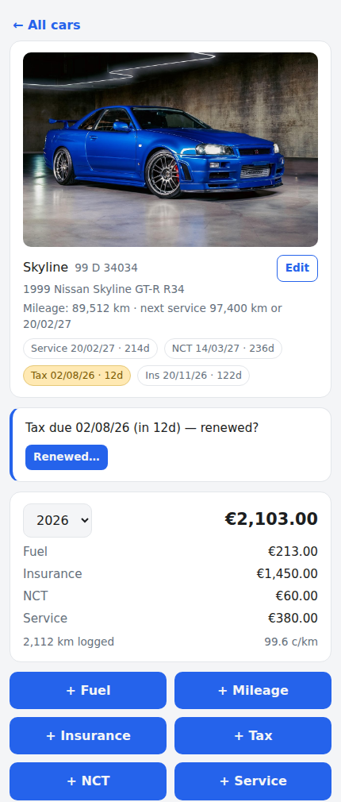
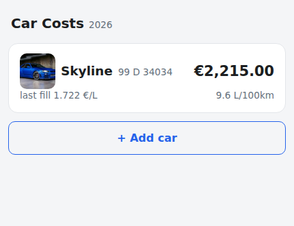

<div align="center">


# Car Costs

*A tiny self-hosted tracker for what your cars actually cost — built to be used
one-handed at the pump.*


<a href="https://buymeacoffee.com/colfin22"></a>

<p>

&nbsp;

</p>

</div>

Open it, tap a car, add the entry. That's the entire workflow. Everything else —
efficiency stats, renewal reminders, NCT lifecycle, Home Assistant sensors —
falls out of the data you'd capture anyway.

## Why

Fuel apps want accounts and ads; spreadsheets die of neglect by February. This
is the middle ground: one small self-hosted page, fast enough to use in the
forecourt, that answers the questions you actually ask — *what does this car
cost per year, per km, and what's due next?*

## Features

**Logging, the way it really happens**
- Fuel fills are amount (€) + odometer; litres optional (€/L derived when
  given). Insurance, motor tax, NCT and servicing are dated amounts, freely
  backdatable — start mid-year and enter January's insurance on day one.
- Standalone mileage entries: log the odometer any time; the newest reading
  shows on the car's page and feeds the stats.
- Odometer readings are validated against the timeline — no backwards or
  impossible values, with backdating fully supported (a reading must simply fit
  between its neighbours in date order).

**A status page per car**
- Tap-to-upload photo (resized server-side, doubles as the home-screen
  thumbnail), make/model/year/VIN, and badges for NCT due, a booked NCT test
  (with countdown), tax and insurance — amber inside 30 days, red overdue.
- Stats as data accrues: year total by category, cost per km, L/100km from
  consecutive fills, current mileage.

**Service log & interval**
- Every service records what was actually carried out — a per-car service
  history (date, odometer, work done, cost) on the status page.
- Set a per-car service interval — km and/or months (12-month default) — and
  the app derives "service due" from the last service, **whichever deadline
  comes first**: badge ("Service in 800 km" / "Service 14/03/27 · 236d"),
  banner when close or overdue, and the time deadline joins the reminder feed.
  Logging a service resets both clocks.
- **Timing belt**, the same dual-deadline treatment (e.g. 160,000 km or 8
  years, whichever first) — but deliberately quiet: belt changes are logged
  from car settings, and nothing appears on the status page until the binding
  deadline is within 2,000 km / 60 days (badge) or 1,000 km / 30 days
  (banner). The years deadline joins the reminder feed like any other date.

**Renewals that close the loop**
- From 14 days before a due date the car's page prompts *"renewed?"* — one
  dialog captures the new date and (optionally) what you paid. Renew early via
  any route and the prompt never appears.
- Full NCT lifecycle: booking a test offers to log the fee (dated the booking
  day); after the test date a banner asks the result — pass sets the new
  expiry, fail offers a paid rebooking or a free visual-only retest, and the
  cycle repeats.

**Lives quietly in your stack**
- **Home Assistant**: REST sensors for per-car year cost, mileage, efficiency,
  cost/km and days-to-next-due, plus a two-line automation for 30-day/7-day
  phone reminders (examples below).
- **EV-ready**: flip a car's electric toggle and it gains kWh × €/kWh charge
  entries — and the matching HA charge-cost sensor brings itself to life. No
  migration when a car goes electric.
- **Cars come and go**: add cars in the UI; retiring a replaced car keeps its
  full history in a restorable "Retired" section.
- **Optional password gate** for internet-facing use (details below), exempting
  internal monitoring/sensor callers. Installable as a home-screen PWA; cars are
  deep-linkable (`#car-1`). Dates day-first. Light/dark. No build step, no
  accounts, no cloud.

## Stack

FastAPI + SQLite (stdlib `sqlite3`, no ORM) + one vanilla-JS page. The database
and photos live in `data/` (gitignored). ~850 lines all-in.

## Run

```bash
python3 -m venv venv
venv/bin/pip install fastapi "uvicorn[standard]" pillow python-multipart
venv/bin/uvicorn main:app --host 0.0.0.0 --port 8000
```

Two placeholder cars are seeded on first run — rename them via **Edit**.
Configuration is via environment variables — see [.env.example](.env.example).

### Exposing it to the internet (optional)

Set `CARCOSTS_PASSWORD` in the environment and any request arriving through a
reverse proxy or tunnel (detected via the `Cf-Connecting-Ip` header, or any
non-private peer address) must log in: a 30-day HMAC session cookie
(`SameSite=None; Secure`, so it survives being iframed in a dashboard), while
direct internal callers — monitoring, Home Assistant sensors — stay exempt.
Rotating the password invalidates every session. Publish the hostname only
after the password is set.

## Home Assistant

**Renewal reminders** — `/api/dues` returns every upcoming NCT/test/tax/
insurance date with a day count, shaped for a REST sensor; one automation gives
30-day and 7-day nudges with all wording and routing kept in Home Assistant:

```yaml
rest:
  - resource: http://<app-host>:8000/api/dues
    scan_interval: 3600
    sensor:
      - name: Car costs next due
        unique_id: car_costs_next_due
        value_template: "{{ value_json.next_days }}"
        unit_of_measurement: d
        json_attributes:
          - items

automation:
  - id: car_costs_due_reminders
    alias: Car costs - renewal reminders (30d/7d)
    triggers:
      - trigger: time
        at: "09:00:00"
    actions:
      - repeat:
          for_each: >-
            {{ state_attr('sensor.car_costs_next_due', 'items')
               | selectattr('days', 'in', [30, 7]) | list }}
          sequence:
            - variables:
                msg: >-
                  {{ repeat.item.car }}: {{ repeat.item.item }} due
                  {{ repeat.item.date }} ({{ repeat.item.days }} days)
            - action: notify.mobile_app_your_phone
              data:
                title: Car reminder
                message: "{{ msg }}"
```

**Per-car stats** — each car's `/api/cars/<id>` response (including a
`next_due` object) feeds one REST resource per car exposing year cost (category
breakdown as attributes), mileage, L/100km, cost/km and days-to-next-due. Two
tips from a real deployment: use `availability:` templates for the
not-yet-populated cases (a numeric-unit REST sensor that renders a placeholder
string fails to register at all), and gate a charge-cost sensor on
`{{ value_json.car.ev_enabled == 1 }}` so it activates itself when a car goes
electric. The resources reference car ids — a replacement car means repointing
one resource.

For a dashboard tab, a full-page `iframe` card pointing at the app works
(https required if your Home Assistant is https) — though the home-screen PWA
is the nicer phone experience.

## API

`GET /api/cars[?include_archived=true]` · `POST /api/cars` ·
`PATCH /api/cars/{id}` (details, due dates, service/belt intervals,
`ev_enabled`, `archived`; an explicit `null` clears a nullable field) ·
`GET /api/cars/{id}?year=` (includes `next_due`, `service_due`, `belt_due`,
`service_log`) · `POST /api/cars/{id}/entries` · `DELETE /api/entries/{id}` ·
`POST /api/cars/{id}/photo` · `GET /api/dues` · `GET /healthz`

## Licence

[MIT](LICENSE)
