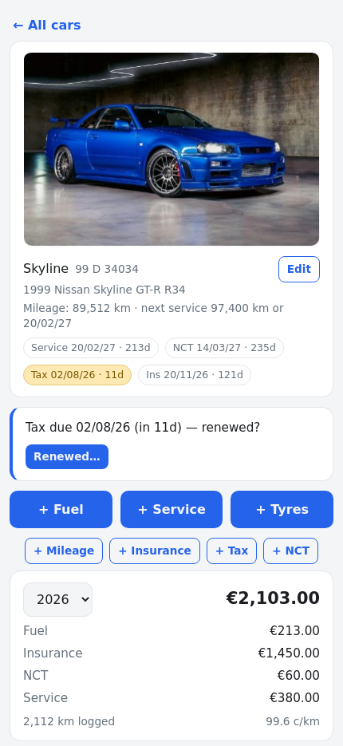
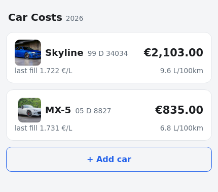
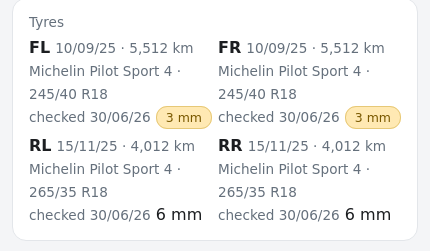

<div align="center">


# Car Costs

*A tiny self-hosted tracker for what your cars actually cost — built to be used
one-handed at the pump.*


<a href="https://buymeacoffee.com/colfin22"></a>

<p>

&nbsp;

</p>

</div>

Open it, tap a car, add the entry. That's the entire workflow.

- **Log in seconds** — a fill is amount + odometer at the pump; tax, insurance,
  NCT and servicing are dated amounts, freely backdatable.
- **See what it really costs** — year total by category, cost per km, L/100km,
  per car.
- **Never miss a date** — badges and banners from 14 days out, plus phone
  reminders through Home Assistant.

**Irish-focused**: NCT, motor tax, euro, kilometres.

## Why

Fuel apps want accounts and ads; spreadsheets die of neglect by February. This
is the middle ground: one small self-hosted page, fast enough to use in the
forecourt, that answers the questions you actually ask — *what does this car
cost per year, per km, and what's due next?*

## Features

**Logging, the way it really happens**
- Fuel fills are amount (€) + odometer; litres optional (€/L derived when
  given). Insurance, motor tax, NCT and servicing are dated amounts, freely
  backdatable — start mid-year and enter January's insurance on day one.
- Standalone mileage entries: log the odometer any time; the newest reading
  shows on the car's page and feeds the stats.
- Odometer readings are validated against the timeline — no backwards or
  impossible values, with backdating fully supported (a reading must simply fit
  between its neighbours in date order).

**A status page per car**
- Tap-to-upload photo (resized server-side, shown in a consistent 4:3 frame
  and doubling as the home-screen thumbnail), make/model/year/VIN, and badges
  for NCT due, a booked NCT test (with countdown), tax and insurance — amber
  inside 30 days, red overdue.
- Stats as data accrues: year total by category, cost per km, L/100km from
  consecutive fills, current mileage.

**Service log & interval**
- Every service records what was actually carried out — a per-car service
  history (date, odometer, work done, cost) on the status page.
- Set a per-car service interval — km and/or months (12-month default) — and
  the app derives "service due" from the last service, **whichever deadline
  comes first**: badge ("Service in 800 km" / "Service 14/03/27 · 236d"),
  banner when close or overdue, and the time deadline joins the reminder feed.
  Logging a service resets both clocks.
- **Timing belt**, the same dual-deadline treatment (e.g. 160,000 km or 8
  years, whichever first) — but deliberately quiet: belt changes are logged
  from car settings, and nothing appears on the status page until the binding
  deadline is within 2,000 km / 60 days (badge) or 1,000 km / 30 days
  (banner). The years deadline joins the reminder feed like any other date.
- **Tyres** are a first-class lifecycle item: a tyre entry records which
  corners were changed (FL/FR/RL/RR), the size and brand (both prefilled from
  last time), cost and odometer — a front pair and a rear pair fitted the same
  day are just two entries. The car page derives a per-corner grid (what's
  fitted, when, and km since). Tyres don't get a predicted due date — wear
  isn't a calendar — so instead there are manual **tyre checks**: a zero-cost
  entry recording which corners you looked at and, optionally, tread depth in
  mm per corner. The grid shows each corner's last check, flagging depths at
  3 mm and below and highlighting anything under the 1.6 mm legal minimum.

<p align="center">

</p>

**Renewals that close the loop**
- From 14 days before a due date the car's page prompts *"renewed?"* — one
  dialog captures the new date and (optionally) what you paid. Renew early via
  any route and the prompt never appears.
- Full NCT lifecycle: booking a test offers to log the fee (dated the booking
  day); after the test date a banner asks the result — pass sets the new
  expiry, fail offers a paid rebooking or a free visual-only retest, and the
  cycle repeats.

**Lives quietly in your stack**
- **Home Assistant**: REST sensors for per-car year cost, mileage, efficiency,
  cost/km and days-to-next-due, plus a two-line automation for 30-day/7-day
  phone reminders (examples below).
- **EV-ready**: flip a car's electric toggle and it gains kWh × €/kWh charge
  entries — and the matching HA charge-cost sensor brings itself to life. No
  migration when a car goes electric.
- **Cars come and go**: add cars in the UI; retiring a replaced car keeps its
  full history in a restorable "Retired" section.
- **Optional password gate** for internet-facing use (details below), exempting
  internal monitoring/sensor callers. Installable as a home-screen PWA; cars are
  deep-linkable (`#car-1`). Dates day-first. Light/dark. No build step, no
  accounts, no cloud.

## Stack

FastAPI + SQLite (stdlib `sqlite3`, no ORM) + one vanilla-JS page. The database
and photos live in `data/` (gitignored). ~1,200 lines all-in.

The app writes a daily snapshot of the database to `data/backups/` (keeps the
last 7, `CARCOSTS_BACKUP_KEEP` to change) using SQLite's `VACUUM INTO` — a
crash-consistent copy that is safe to restore, unlike a plain file copy of a
live database. Point host-level backups at `data/`; if restoring, prefer the
newest file in `data/backups/`. Photos are ordinary files and copy safely.

## Run

```bash
python3 -m venv venv
venv/bin/pip install fastapi "uvicorn[standard]" pillow python-multipart
venv/bin/uvicorn main:app --host 0.0.0.0 --port 8000
```

One placeholder car is seeded on first run — rename it via **Edit**, and add
more with **+ Add car**.
Configuration is via environment variables — see [.env.example](.env.example).

### Install it as a phone app (PWA)

There's no app store — there doesn't need to be. The page is an installable
PWA: open your instance in the phone's browser and add it to the home screen
(Android Chrome: **⋮ → Add to Home screen**; iOS Safari: **Share → Add to Home
Screen**). It installs with its own icon and opens fullscreen like a native
app. For install and use away from home the instance needs to be reachable
over HTTPS — see the next section.

### Security model (when exposed to the internet)

With `CARCOSTS_PASSWORD` set, a request must log in when it **arrives through
the tunnel/proxy** (a `Cf-Connecting-Ip` header is present) **or comes from a
non-private peer address**. Requests from private-range addresses with no
proxy header are trusted without credentials.

- **Trusted, no login**: a Home Assistant REST sensor polling
  `http://10.x.x.x:8000/api/dues` on your LAN; an uptime monitor hitting
  `/healthz` directly.
- **Gated**: any browser arriving via your public hostname through the tunnel
  — pages redirect to `/login`, API calls get 401.

This assumes the tunnel is the *only* internet route to the app — if you
port-forward directly instead, the non-private-peer check still gates it, but
don't run both patterns at once without thinking it through. Sessions are
30-day HMAC cookies (`SameSite=None; Secure`, so the app survives being
iframed in a dashboard); rotating the password invalidates every session.
`/login` and `/healthz` are always public. Publish the hostname only after
the password is set.

## Home Assistant

A ready-to-use package lives at
[examples/car_costs.yaml](examples/car_costs.yaml) — drop it into your
`packages/` folder, set the app host and your notify service, and you get:

- **Renewal reminders** — a REST sensor on `/api/dues` (every upcoming
  NCT/test/tax/insurance date with a day count) plus one automation for 30-day
  and 7-day phone nudges, with all wording and routing kept in Home Assistant.
- **Per-car stats** — each car's `/api/cars/<id>` response feeds one REST
  resource exposing year cost (category breakdown as attributes), mileage,
  L/100km, cost/km and days-to-next-due; duplicate the block per car.

Two tips from a real deployment, already baked into the example: use
`availability:` templates for the not-yet-populated cases (a numeric-unit REST
sensor that renders a placeholder string fails to register at all), and gate a
charge-cost sensor on `{{ value_json.car.ev_enabled == 1 }}` so it activates
itself when a car goes electric. The resources reference car ids — a
replacement car means repointing one resource.

For a dashboard tab, a full-page `iframe` card pointing at the app works
(https required if your Home Assistant is https) — though the home-screen PWA
is the nicer phone experience.

## API

`GET /api/cars[?include_archived=true]` · `POST /api/cars` ·
`PATCH /api/cars/{id}` (details, due dates, service/belt intervals,
`ev_enabled`, `archived`; an explicit `null` clears a nullable field) ·
`GET /api/cars/{id}?year=` (includes `next_due`, `service_due`, `belt_due`,
`service_log`) · `POST /api/cars/{id}/entries` · `DELETE /api/entries/{id}` ·
`POST /api/cars/{id}/photo` · `GET /api/dues` · `GET /healthz`

## Licence

[MIT](LICENSE) © 2026 Colm Finn.
