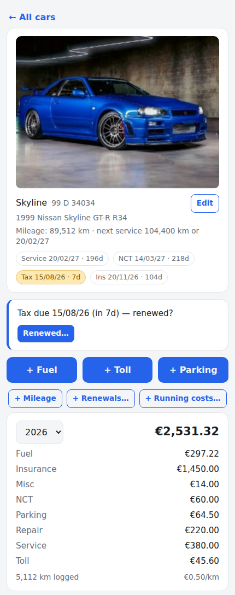
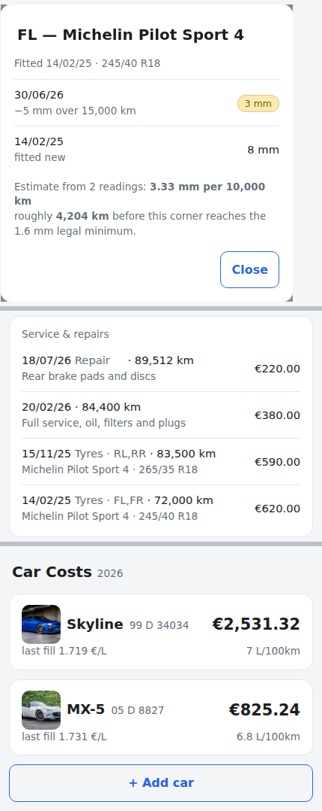

<div align="center">


# Car Costs

*A tiny self-hosted tracker for what your cars actually cost — built to be used
one-handed at the pump.*


[](https://hub.docker.com/r/colfin22/car-costs)

<a href="https://buymeacoffee.com/colfin22"></a>

<p>

&nbsp;

</p>

</div>

Open it, tap a car, add the entry. That's the entire workflow.

- **Log in seconds** — a fill is amount + odometer at the pump; tax, insurance,
  NCT and servicing are dated amounts, freely backdatable.
- **See what it really costs** — year total by category, cost per km, L/100km,
  per car. Tolls and parking count too, either per journey or as a monthly
  total off a tag account.
- **Never miss a date** — badges and banners from 14 days out, plus phone
  reminders through Home Assistant.

**Irish-focused**: NCT, motor tax, euro, kilometres.

## Why

Fuel apps want accounts and ads; spreadsheets die of neglect by February. This
is the middle ground: one small self-hosted page, fast enough to use in the
forecourt, that answers the questions you actually ask — *what does this car
cost per year, per km, and what's due next?*

## Features

**Logging, the way it really happens**
- Fuel fills are amount (€) + odometer; litres optional (€/L derived when
  given). Insurance, motor tax, NCT and servicing are dated amounts, freely
  backdatable — start mid-year and enter January's insurance on day one.
- Standalone mileage entries: log the odometer any time; the newest reading
  shows on the car's page and feeds the stats.
- Odometer readings are validated against the timeline — no backwards or
  impossible values, with backdating fully supported (a reading must simply fit
  between its neighbours in date order).
- **Tap any entry to see what you logged** — the lists show a one-line
  summary; tapping opens the full record: every field captured, its
  attachments, an edit and a delete. Editing warns you first if the change
  would move a service or belt due date, showing the old date and the new one.
- Document attachments: hang receipts, invoices, certs and test reports (PDF or
  photos, 10 MB each) on any entry via the 📎 on its row, or in the car's Docs
  and pics card for anything with no cost attached. A plain file picker sits
  alongside for PDFs and existing photos, stored exactly as received.
- **Scan** a receipt and it comes out flat: the camera opens directly, the
  server finds the document in the photo and flattens it, and you pick between
  the crop and the photo as taken. Nothing is stored until you pick. Retake
  reopens the camera if the photo itself missed, and if no document is found
  you are offered the shot as taken or another go. Detection is server-side, so
  it does not depend on the phone; an instance without the optional scanning
  dependency simply attaches what you took.
- **Pic** is the same camera with no crop step, for a wheel, a paint defect or
  crash damage. Both sit in the Docs and pics card; an expense offers Scan only.
- Every scan and pic offers **Take another**, so a set of damage photos or a
  multi-page receipt is one trip. Each lands as it is taken.

**A status page per car**
- Tap-to-upload photo (resized server-side, shown in a consistent 4:3 frame
  and doubling as the home-screen thumbnail), make/model/year/VIN, and badges
  for NCT due, a booked NCT test (with countdown), tax and insurance — amber
  inside 30 days, red overdue.
- Stats as data accrues: year total by category, cost per km, L/100km from
  consecutive fills, current mileage.

**Service log & interval**
- Every service records what was actually carried out — a per-car service
  history (date, odometer, work done, cost) on the status page. The Service
  button offers a **quick check** too: a zero-cost note for things you checked
  rather than paid for (coolant, oil, tyre pressures).
- Set a per-car service interval — km and/or months (12-month default) — and
  the app derives "service due" from the last service, **whichever deadline
  comes first**: badge ("Service in 800 km" / "Service 14/03/27 · 236d"),
  banner when close or overdue, and the time deadline joins the reminder feed.
  Logging a service resets both clocks.
- **Repairs** — brakes, a clutch, an exhaust — are logged from the same Service
  button and counted in the year's costs and by-category breakdown, listed
  alongside services but tagged. They have **no effect on the service
  interval**: a repair never resets the clock.
- **Timing belt**, the same dual-deadline treatment (e.g. 160,000 km or 8
  years, whichever first) — but deliberately quiet: belt changes are logged
  from car settings, and nothing appears on the status page until the binding
  deadline is within 2,000 km / 60 days (badge) or 1,000 km / 30 days
  (banner). The years deadline joins the reminder feed like any other date.
- **Tyres** are a first-class lifecycle item. A tyre entry records the corners
  changed (FL/FR/RL/RR), size and brand (prefilled from last time), cost and
  odometer, and the car page derives a per-corner grid of what's fitted, when,
  and km since. Wear isn't a calendar, so there's no due date — instead,
  zero-cost **tyre checks** record tread depth per corner, flagged at 3 mm and
  highlighted under the 1.6 mm legal minimum, measured against a full-tread
  baseline set when the tyres go on (8 mm default, editable). Tap a corner for
  its reading history, the change in mm and km since the last check, and — once
  there are two readings — an estimated wear rate and rough distance to 1.6 mm.
- **Tolls and parking** get a button each on the car page and land in the year
  total, the by-category breakdown and the cost per km like any other spend.
  Each takes either a single charge (one journey, one stay) or a monthly total
  off a tag account or a parking permit, so a statement is one entry instead of
  forty — picking monthly swaps the date field to a month picker. Both styles
  share one Tolls line and one Parking line in the totals, and monthly rows are
  marked as such in the recent list.
- **Misc** catches the small stuff that fits nowhere else — a car wash, a few
  euro in the air pump. A dated amount and a required note, counted in the
  totals and the cost per km like everything else.
- The entry buttons stay short on a phone: **fuel, toll and parking** on the
  main row (plus charge on an EV), **mileage** beside it, and two groups behind
  a tap — **renewals** (insurance, tax, NCT) and **running costs** (servicing,
  tyres and misc, each with the choices described above).

**Renewals that close the loop**
- From 14 days before a due date the car's page prompts *"renewed?"* — one
  dialog captures the new date and (optionally) what you paid. Renew early via
  any route and the prompt never appears.
- Full NCT lifecycle: booking a test offers to log the fee (dated the booking
  day); after the test date a banner asks the result — pass sets the new
  expiry, fail offers a paid rebooking or a free visual-only retest, and the
  cycle repeats.

**Lives quietly in your stack**
- **Home Assistant**: REST sensors for per-car year cost, mileage, efficiency,
  cost/km and days-to-next-due, plus a two-line automation for 30-day/7-day
  phone reminders (examples below).
- **EV-ready**: flip a car's electric toggle and it gains kWh × €/kWh charge
  entries — and the matching HA charge-cost sensor brings itself to life. No
  migration when a car goes electric.
- **Cars come and go**: add cars in the UI; retiring a replaced car keeps its
  full history in a restorable "Retired" section.
- **Password gate** — set `CARCOSTS_PASSWORD` on every install (details below),
  with an optional second factor from an authenticator app;
  internal monitoring/sensor callers on the LAN stay credential-free. Installable as a home-screen PWA; cars are
  deep-linkable (`#car-1`). Dates day-first. Light/dark. No build step, no
  accounts, no cloud.

## Stack

FastAPI + SQLite (stdlib `sqlite3`, no ORM) + one vanilla-JS page. The database
and photos live in `data/` (gitignored). ~2,600 lines all-in.

The app writes a daily snapshot of the database to `data/backups/` (keeps the
last 7, `CARCOSTS_BACKUP_KEEP` to change) using SQLite's `VACUUM INTO` — a
crash-consistent copy that is safe to restore, unlike a plain file copy of a
live database. Point host-level backups at `data/`; if restoring, prefer the
newest file in `data/backups/`. Photos and document attachments (`data/photos/`,
`data/docs/`) are ordinary files and copy safely.

## Run

```bash
python3 -m venv venv
venv/bin/pip install fastapi "uvicorn[standard]" pillow python-multipart
venv/bin/uvicorn main:app --host 0.0.0.0 --port 8000
```

Two features are optional and the app runs fine without either. Scan cropping
needs `opencv-python-headless`, which is a large install of roughly 250 MB once
unpacked, so it is worth skipping on a small box if you do not want it. The
second factor at login needs `pyotp` and `qrcode`, which are tiny. Both report
themselves on `/healthz`, and the app hides what it cannot do.

```bash
venv/bin/pip install opencv-python-headless   # scan cropping
venv/bin/pip install pyotp qrcode             # optional second factor
```

One placeholder car is seeded on first run — rename it via **Edit**, and add
more with **+ Add car**.
Configuration is via environment variables — see [.env.example](.env.example).

### Docker

Pre-built multi-arch images (amd64 + arm64) are published to GHCR on each
release:

```bash
docker run -d -p 8000:8000 -v carcosts-data:/srv/data ghcr.io/colfin22/car-costs:latest
```

The same images are also on Docker Hub as
[`colfin22/car-costs`](https://hub.docker.com/r/colfin22/car-costs).

The published images include everything, scan cropping included, which is what
makes them a few hundred MB rather than tens. If you would rather have a small
image, drop `opencv-python-headless` from `requirements.txt` and build your own.
Everything except the scan crop works without it.

Or use the included [docker-compose.yml](docker-compose.yml)
(`docker compose up -d`), which also shows the environment variables. The
database, photos and daily backups all live under `/srv/data` — one volume
covers everything.

Never used Docker? The [step-by-step setup guide](docs/setup.md) takes about
ten minutes, phone install and backups included.

### Install it as a phone app (PWA)

There's no app store — there doesn't need to be. The page is an installable
PWA: open your instance in the phone's browser and add it to the home screen
(Android Chrome: **⋮ → Add to Home screen**; iOS Safari: **Share → Add to Home
Screen**). It installs with its own icon and opens fullscreen like a native
app. For install and use away from home the instance needs to be reachable
over HTTPS — see the next section.

### Security model (when exposed to the internet)

With `CARCOSTS_PASSWORD` set, a request must log in when it **arrives through
the tunnel/proxy** (a `Cf-Connecting-Ip` header is present) **or comes from a
non-private peer address**. Requests from private-range addresses with no
proxy header are trusted without credentials.

- **Trusted, no login**: a Home Assistant REST sensor polling
  `http://10.x.x.x:8000/api/summary` on your LAN; an uptime monitor hitting
  `/healthz` directly.
- **Gated**: any browser arriving via your public hostname through the tunnel
  — pages redirect to `/login`, API calls get 401.

This assumes the tunnel is the *only* internet route to the app — if you
port-forward directly instead, the non-private-peer check still gates it, but
don't run both patterns at once without thinking it through. Sessions are
30-day HMAC cookies (`SameSite=None; Secure`, so the app survives being
iframed in a dashboard); rotating the password invalidates every session.
`/login` and `/healthz` are always public. Publish the hostname only after
the password is set.

#### Optional second factor

On top of the password you can add a six digit code from an authenticator app.
It is off unless you turn it on, and it needs a password to sit on top of.

Open **Security** under the version number on the home screen, scan the QR with
your authenticator, and confirm one code. The second factor only switches on
once a code proves the scan worked. You also get eight recovery codes, shown
once. Each one works once, anywhere a code from the app works. On a headless
box, or if you cannot reach the UI, `python main.py --totp-setup` does the same
thing in the terminal (`docker exec -it car-costs python main.py --totp-setup`).

The code is checked at `/login`, before the session cookie is issued. A valid
cookie still means both factors passed, so nothing else in the app changes. The
secret and the hashed recovery codes live in your database, so your backups
already cover them. Lost the phone and the recovery codes? Reach the app from
your LAN, or clear `CARCOSTS_PASSWORD`, and turn it off again.

## Home Assistant

A ready-to-use package lives at
[examples/car_costs.yaml](examples/car_costs.yaml) — drop it into your
`packages/` folder, set the app host and your notify service, and you get:

**One poll, all cars — including future ones.** A single REST sensor fetches
`/api/summary` and holds every car (and all upcoming dues) in its attributes.
The reminders automation reads that combined dues list, so it covers every car
with **no per-car configuration** — add a car in the app and the 30-day/7-day
nudges just include it. This is the whole setup for reminders and for reading
any car's stats via `state_attr('sensor.car_costs_summary', 'cars')`.

The example also includes an **optional** section that turns each car into its
own sensor entity (for history graphs or per-car automations). Home Assistant
can't generate entities from a list, so that part needs one small block per
car — copy the "Car N" group and change the id. It's not needed just to read
the data; the summary sensor already exposes all of it. Per car you get: year
cost (with a `by_category` attribute), odometer, distance driven this year,
fuel efficiency, cost per km, price paid at the last fill, charge cost if the
car is set to electric, and the soonest thing due.

A second optional block gives **each due item its own sensor**: service, tax,
insurance, NCT and the timing belt, each reporting days remaining with the date
as an attribute. Worth adding if you want one of them on a dashboard card or as
an automation trigger. One thing to know: rows in the `dues` list identify a car
by name rather than by id, so those sensors are keyed on the car's name. Change
the name in the app and you have to change it in the package too.

For a dashboard tab, a full-page `iframe` card pointing at the app works
(https required if your Home Assistant is https) — though the home-screen PWA
is the nicer phone experience.

## API

`GET /api/cars[?include_archived=true]` · `POST /api/cars` ·
`PATCH /api/cars/{id}` (details, due dates, service/belt intervals,
`ev_enabled`, `archived`; an explicit `null` clears a nullable field) ·
`GET /api/cars/{id}?year=` (includes `next_due`, `service_due`, `belt_due`,
`service_log`, `tyre_history`) · `POST /api/cars/{id}/entries` ·
`PATCH /api/entries/{id}[?dry_run=true]` (correct an entry; the dry run reports
which due dates the change would move, without saving) ·
`DELETE /api/entries/{id}` · `POST /api/scan/preview` (crop a photo to the
document in it and hand it straight back, storing nothing) ·
`POST /api/cars/{id}/photo` · `GET /api/dues` ·
`GET /api/summary[?year=&include_archived=]` (all cars + dues in one payload,
for driving several Home Assistant sensors from a single poll) · `GET /healthz`

## Licence

[MIT](LICENSE) © 2026 Colm Finn.
